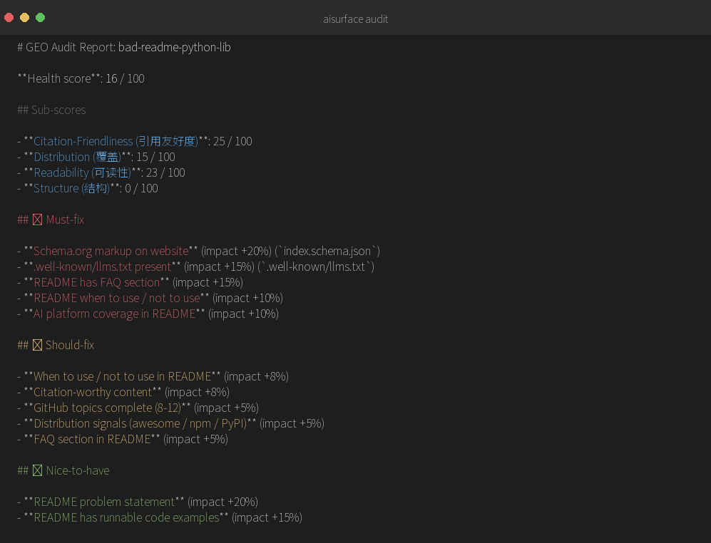
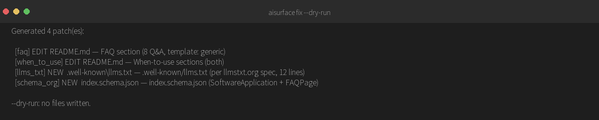
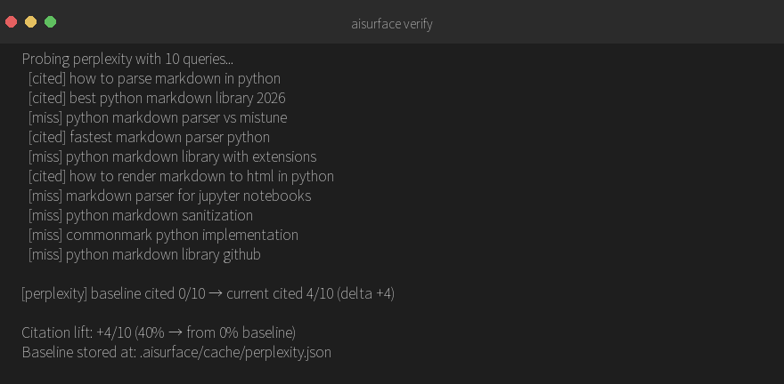

# aisurface

> 让你的开源项目在 AI 搜索结果里浮到表面。

[English](./README.en.md) | 中文

```bash
npx skills add ruijayfeng/aisurface
```

装完跟我说一句"诊断我的项目"就行,Python 环境我自己处理。

```text
"看看我的项目能不能被 AI 搜到"          →  诊断
"按 AI 搜索最佳实践改我的项目"          →  修
"现在 AI 真的引用我项目了吗"            →  验证
```





aisurface 是一个 Claude Code 工具，专门帮**开源项目维护者**让自己的项目**优先被 AI 搜索主动引用**（豆包 / DeepSeek / ChatGPT / Gemini / Claude / Perplexity / Kimi / 文心 / 通义 / 智谱……）。

## 为什么需要 aisurface？

2026 年，开发者不再 Google 搜「Python 解析 Markdown 的库」，而是直接问 ChatGPT「推荐一个 Python Markdown 解析库」。

AI 只会引用 3-5 个来源。**如果你的项目不在那 3-5 个里，对 AI 用户来说你就不存在。**

传统 SEO 工具（`seo-audit`、`seo-geo`）只诊断 URL 视角的英文 Google SEO，不针对开源项目，不针对中文 AI。aisurface 填补这个空白。

## 三步走完整流程

```bash
# 1) 审计：跑 12 项 GEO 检查，看哪里被 AI 漏掉了
aisurface audit .

# 2) 修复：自动应用 4 个最高频 Must-fix
aisurface fix .

# 3) 验证：用真实 AI 平台探测引用率，对比基线
export PERPLEXITY_API_KEY=...
aisurface verify .                # 第一次跑：建立基线
aisurface fix .                   # 跑一次修复
aisurface verify .                # 第二次跑：对比基线，输出提升幅度
```

`fix` 会生成：README FAQ 段、When-to-use 段、`.well-known/llms.txt`、`index.schema.json`。review diff，确认，写盘，完事。

`verify` 会向 Perplexity 投送 10 条代表性 query（更多平台在路上），把当前引用率与本地保存的基线做对比，给出数字化的提升幅度。

## 12 项审计清单

| # | 检查项 | 类型 |
|---|---|---|
| 1 | README problem statement | 语义 |
| 2 | README FAQ 段 | 语义 |
| 3 | README when to use / not to use | 语义 |
| 4 | README 可运行代码示例 | 语义 |
| 5 | Schema.org 标记 | 结构 |
| 6 | `.well-known/llms.txt` | 结构 |
| 7 | GitHub topics 完整（8-12 个）| 结构 |
| 8 | README 含 FAQ 段标题 | 语义 |
| 9 | README 含 When to use / not to use 段 | 语义 |
| 10 | 原创可引用内容（数字 / 代码 / 命名实体）| 语义 |
| 11 | 分布信号（awesome / npm / PyPI）| 结构 |
| 12 | README 提及的 AI 搜索平台数 | 语义 |

## 实战案例

我们用 [ruijayfeng/ziwei](https://github.com/ruijayfeng/ziwei) 做 v1.0 dogfooding：
- **基线**：health score 35/100，5 项 🔴 Must-fix
- **应用 4 个 patch 后**：health score 87/100，🔴 全部清零（+52）

详见 [case-studies/ziwei-v100.md](./case-studies/ziwei-v100.md)。

## 安装

主路径(推荐):

```bash
npx skills add ruijayfeng/aisurface
```

装完跟我说一句"诊断我的项目"就行,Python 环境我自己处理。

备选(给 CI 或不用 Claude Code 的人):

```bash
pip install aisurface
aisurface audit ./
```

## 贡献

欢迎 issue / PR / case study 投稿。详见 [CONTRIBUTING.md](./CONTRIBUTING.md)。

## License

MIT
